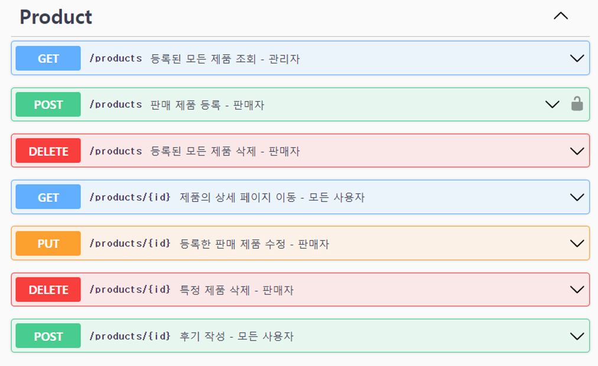
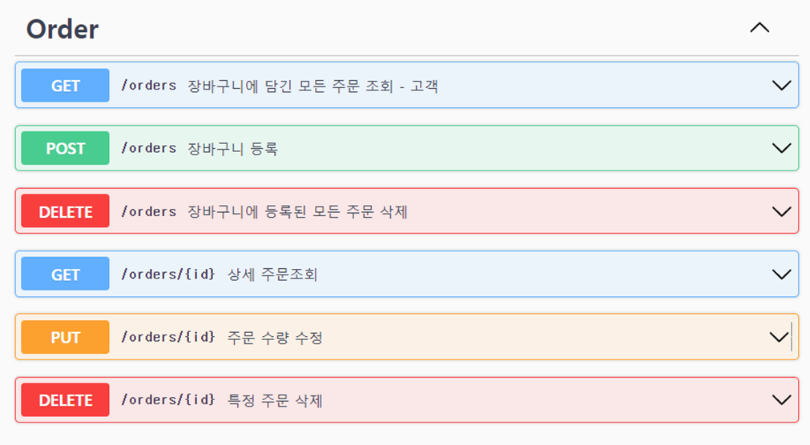

# 프로젝트 개요

온라인 쇼핑몰 웹 어플리케이션

*2023.03.04 ~*

프로젝트 구조
````
|-- Dockerfile
|-- README.md
|-- build
|   `-- swagger.yaml
|-- cert
|   |-- cert.pem
|   `-- key.pem
|-- config
|   |-- database.js
|   |-- passport.js
|   |-- redis.js
|   `-- sendEmail.js
|-- controller
|   |-- order.js
|   |-- product.js
|   `-- user.js
|-- docker-compose.yml
|-- index.js
|-- middleware
|   |-- check-admin.js
|   `-- globalErrorHandler.js
|-- model
|   |-- like.js
|   |-- order.js
|   |-- product.js
|   |-- reply.js
|   `-- user.js
|-- nginx
|   `-- nginx.conf
|-- package-lock.json
|-- package.json
|-- routes
|   |-- order.js
|   |-- product.js
|   `-- user.js
|-- swagger
|   |-- openapi.yaml
|   |-- orders.yaml
|   |-- products.yaml
|   `-- users.yaml
````

## Stack
<br>

<br>

<br><br>

# REST API
아래 버튼을 눌러 API에 대해 자세히 확인하세요.
[](https://app.swaggerhub.com/apis/IMLOGIC20_1/e-commerce/1.0.0)





# Trouble shooting
프로젝트를 진행하면서 발생했던 문제, 해결방법, 문제해결을 위한 과정 들을 작성하였습니다.

### Redis 메모리를 활용한 API 응답속도 25% 개선
[Redis 메모리를 활용한 API 응답속도 25% 개선.pdf](..%2F..%2F..%2F..%2FUsers%2Fimlog%2FDownloads%2FRedis%20%B8%DE%B8%F0%B8%AE%B8%A6%20%C8%B0%BF%EB%C7%D1%20API%20%C0%C0%B4%E4%BC%D3%B5%B5%2025%25%20%B0%B3%BC%B1.pdf)